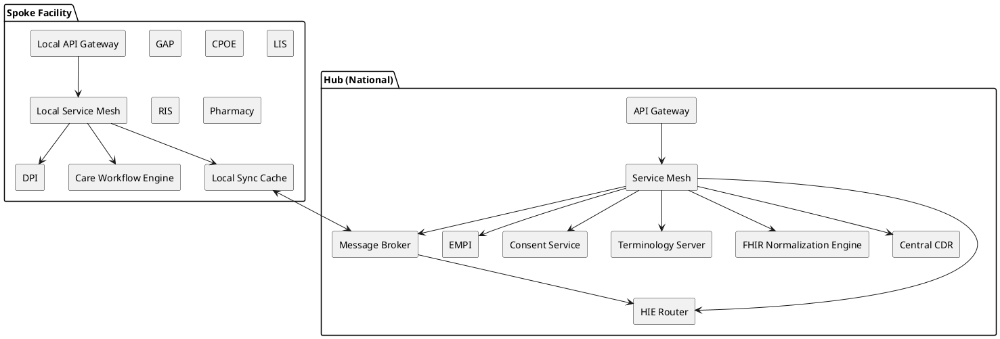
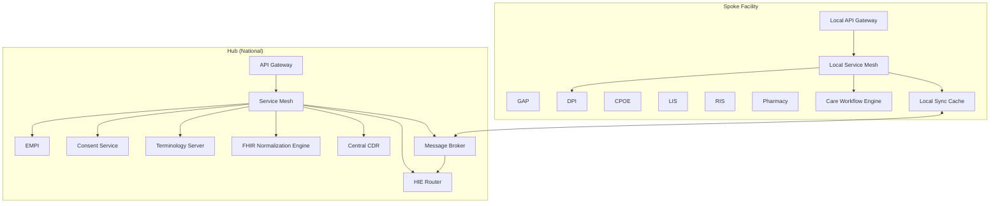
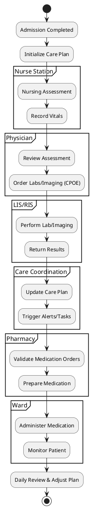
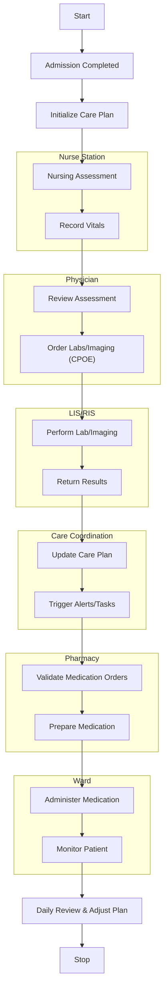
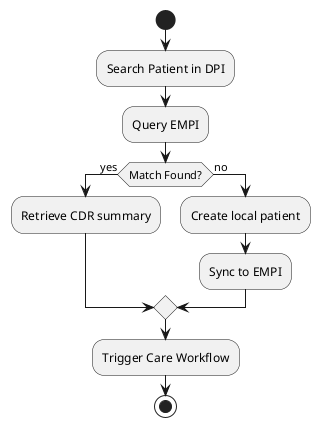
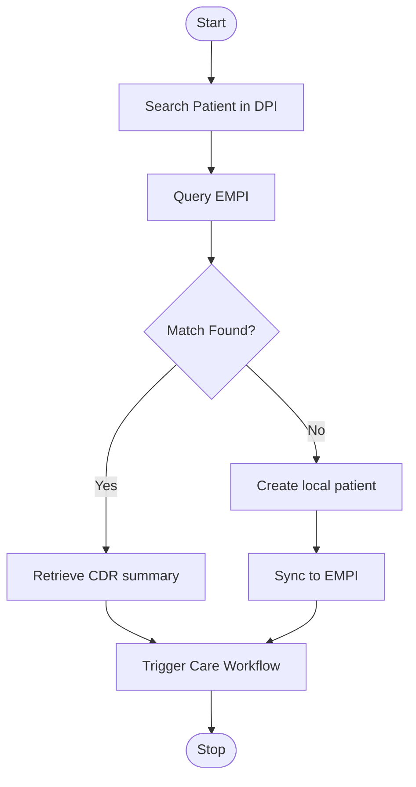

# SPEC-1-Hub-and-Spoke National Health System Architecture

## Background

A national eHealth ecosystem is being designed according to a hub-and-spoke architecture. Each healthcare facility (spoke) contains its local operational systems—GAP, DPI, CPOE, LIS, RIS, Pharma—while a centralized Health Information Exchange (HIE) hub enables interoperability, master patient identity management (EMPI), consent management, secure routing of clinical transactions, and normalization of clinical data.

The initial architecture required consolidation, risk mitigation, and modernization. This specification defines the **optimal end-to-end architecture**, including data governance, terminology management, multi-tenancy, offline capability, workflow orchestration, and secure microservice communication.

## Requirements

### Must Have (M)

* M1: Centralized Health Information Exchange (HIE) supporting FHIR R5.
* M2: Master Patient Index (EMPI) with deterministic + probabilistic matching.
* M3: Standardized Terminology Service (SNOMED CT, LOINC, ICD-10).
* M3: Consent Management integrated into HIE.
* M4: Secure API Gateway + Service Mesh for zero-trust interservice communication.
* M5: Offline-first clinic nodes with full clinical autonomy (up to several days).
* M6: Clinical Data Repository (CDR) at the hub for normalized longitudinal data.
* M7: Workflow Orchestrator (BPMN/Temporal/Camunda) at each facility.
* M8: Multi-tenancy per facility with full isolation.
* M9: Event sourcing + audit trails across all transactions.

### Should Have (S)

* S1: Store-and-forward message queues for intermittent connectivity.
* S2: Operational dashboards and observability stack.
* S3: Data lake for analytics and AI/ML pipelines.

### Could Have (C)

* C1: Health Knowledge Graph for population analytics.
* C2: Predictive analytics triggers integrated into workflows.

### Won’t Have (W)

* W1: Full national EHR consolidation (hub does not replace facility DPI).

## Method

### 1. **High-Level Architecture**





### 2. **Core Components**

#### **2.1 HIE Router (FHIR R5)**

* Routes messages using SMART-on-FHIR security.
* Manages facility-specific routing rules.
* Handles versioning and FHIR document reconciliation.

#### **2.2 EMPI**

* Deterministic matching: MRN, national ID, phone.
* Probabilistic matching: Jaro-Winkler, Fellegi-Sunter.
* Supports survivorship rules.

**Patient Identity Table (simplified):**

```plaintext
patient_identity(
  id UUID PK,
  mrn VARCHAR,
  national_id VARCHAR,
  phone VARCHAR,
  facility_id UUID,
  confidence_score FLOAT,
  master_patient_id UUID
)
```

#### **2.3 Terminology Service**

* Based on open-source Snowstorm (SNOMED CT).
* Supports LOINC + ICD-10 mapping.
* Exposed via FHIR Terminology API.

#### **2.4 Consent Management Service**

* Stores patient consent decisions.
* Enforced at query time in the HIE Router.

#### **2.5 Central Clinical Data Repository (CDR)**

* Stores **normalized FHIR resources**.
* Append-only event store to support versioning.

**FHIR Event Table:**

```plaintext
fhir_events(
  event_id UUID,
  resource_type VARCHAR,
  resource_id VARCHAR,
  version INT,
  payload JSONB,
  timestamp TIMESTAMP,
  facility_id VARCHAR
)
```

#### **2.6 Local Clinical Systems**

Each spoke contains:

* GAP
* DPI
* CPOE
* LIS, RIS
* Pharmacy
* **Workflow Engine (BPMN/Temporal)**

#### **2.7 Offline Mode and Synchronization**

* Incoming/outgoing traffic queued in **Local Sync Cache** using Kafka/Redpanda.
* Store-and-forward pattern for all FHIR messages.
* Conflict resolution rules:

  * Last Writer Wins for administrative data.
  * Versioned merges for clinical resources.

### 3. Workflows

#### **3.2 Care Workflow Post‑Admission (BPMN)**





#### **3.1 Patient Admission (Sample BPMN)**





### 4. **Security and Networking**

* API Gateway for request enforcement.
* Service Mesh (Istio) for mTLS and policy enforcement.
* OAuth2 / OIDC with Keycloak.
* Event-level audit logs.

### 5. **Facility Segmentation Model**

* Each facility operates its **own independent infrastructure** (on-premise or cloud) and is not a logical tenant within a shared platform.
* The hub maintains **facility-aware segmentation**, not multi-tenancy:

  * FHIR store is segmented using `facility_id` namespaces.
  * CDR events are partitioned per facility.
  * Message broker topics are facility-specific.
  * Authentication/authorization realms are separated per facility.
* Provides strict **data isolation**, **routing control**, **audit boundaries**, and **governance** for each facility.

### 6. **Data Flow Overview**

1. Clinical action at facility → local system
2. Local Event → Local Sync Cache
3. Forward to Hub → HIE Router
4. Normalize → Terminology → CDR
5. EMPI reconciliation
6. Consent enforcement on access

## Implementation

### Step-by-step

1. **Foundation Layer**

   * Deploy Kubernetes-based infrastructure.
   * Install Istio service mesh.
   * Deploy API gateway (Kong/NGINX APIM).

2. **Hub Services**

   * Deploy EMPI
   * Deploy Terminology Server
   * Deploy HIE Router
   * Deploy Consent Service
   * Deploy Central CDR / FHIR store
   * Deploy Message Broker

3. **Spoke Nodes**

   * Deploy Local API Gateway
   * Deploy Local Service Mesh
   * Deploy Sync Cache (Redpanda/Kafka)
   * Integrate local DPI/GAP modules
   * Deploy Workflow Engine (Camunda/Temporal)

4. **Data Integration**

   * Configure facility-specific adapters
   * Map HL7v2 → FHIR
   * Implement normalization rules

5. **Security Setup**

   * OAuth2 realms per facility
   * mTLS configuration
   * Zero-trust policies

## Milestones

1. **M1 – Infrastructure Base** (Month 1–2)
2. **M2 – Hub Core Services Operational** (Month 3–4)
3. **M3 – First Facility Pilot** (Month 5)
4. **M4 – Multi-Facility Rollout** (Month 6–9)
5. **M5 – Analytics + Data Lake** (Month 10–12)

## Gathering Results

* Evaluate latency of HIE routing.
* Confirm EMPI match accuracy (>95% deterministic, >85% probabilistic).
* Validate full clinical autonomy offline.
* Confirm compliance with privacy regulations.
* Conduct interoperability certification tests.

